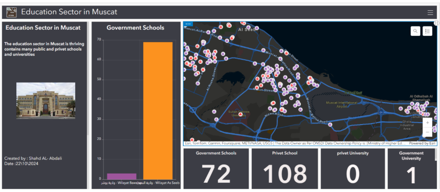

# 📊 Education Dashboard – Muscat, Oman

## 📌 Overview
This project presents an interactive GIS dashboard for visualizing the distribution of schools and universities (public and private) in Muscat, Oman.

---

## 🎯 Objectives
- Visualize educational institutions spatially  
- Support decision-making in education planning  
- Provide interactive insights using GIS dashboards  

---

## 🛠️ Tools Used
- ArcGIS Online Dashboard  
- GIS Data (schools & universities locations)  

---

## 🧠 Features
- Interactive map of schools and universities  
- Summary statistics (counts by type)  
- Filters for public and private institutions  

---

## 🗺️ Dashboard Preview

---

## 📍 Study Area
Muscat, Oman  

---

## 👩‍💻 Author
Shahd Al Abdali  
GIS & Remote Sensing
